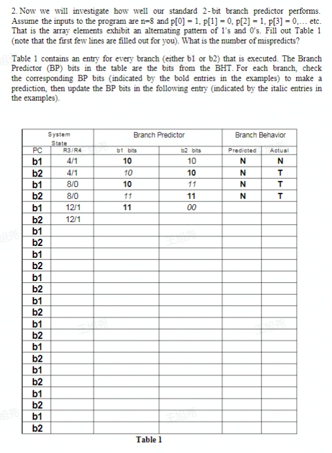
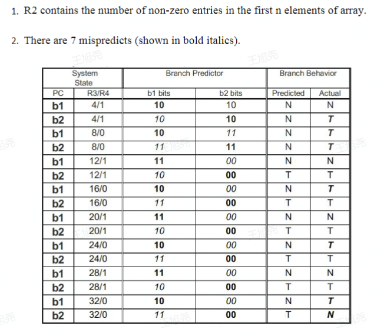

# pipeline
This version realizes branch prediction based on branch master. In test instructions my code could predict if br instruction will be taken and correct target address if prediction is wrong.
The algorithm of prediction is [Prediction based on two-digit saturation counter](https://zhuanlan.zhihu.com/p/490749315). 
The state machine is written in bp.v
It might have many bugs in my code,if run on other instructions you must prepare to debug.
Test instructions is adapted from the question in the picture below

and the corresponding answer is as follows

In test instruction
```
0  : 24010008;  % main:   addiu $1, $0, 8 | 00100100000000010000000000001000 %
1  : 24020000;  %         addiu $2, $0, 1 | 00100100000000100000000000000001 %
2  : 24050001;  %         addiu $5, $0, 1 | 00100100000001010000000000000001 %
3  : 24030000;  %         addiu $3, $0, 0 | 00100100000000110000000000000000 %
4  : ac050000;  %         sw $5, 0($0) | 10101100000001010000000000000000 %
5  : ac000004;  %         sw $0, 4($0) | 10101100000000000000000000000100 %
6  : ac050008;  %         sw $5, 8($0) | 10101100000001010000000000001000 %
7  : ac00000c;  %         sw $0, 12($0) | 10101100000000000000000000001100 %
8  : ac050010;  %         sw $5, 16($0) | 10101100000001010000000000010000 %
9  : ac000014;  %         sw $0, 20($0) | 10101100000000000000000000010100 %
a  : ac050018;  %         sw $5, 24($0) | 10101100000001010000000000011000 %
b  : ac00001c;  %         sw $0, 28($0) | 10101100000000000000000000011100 %
c  : 8c640000;  % loop:   lw $4, 0($3) | 10001100011001000000000000000000 %
d  : 24630004;  %         addiu $3, $3, 4 | 00100100011000110000000000000100 %
e  : 00250823;  %         subu $1, $1, $5 | 00000000001001010000100000100011 %
f  : 10800002;  % b1:     beq $4, $0, b2 | 00010000100000000000000000000010 %
10 : 24e70000;  %         addiu $7, $7, 0 | 00100100111001110000000000000000 %
11 : 24420001;  %         addiu $2, $2, 1 | 00100100010000100000000000000001 %
12 : 1420fff9;  % b2:     bne $1, $0, loop | 00010100001000001111111111111001 %
13 : 24e70000;  %         addiu $7, $7, 0 | 00100100111001110000000000000000 %
14 : 08000000;  %         j main | 00001000000000000000000000000000 %
```
should we pay attention is 
```
24e70000;  %         addiu $7, $7, 0 | 00100100111001110000000000000000 %
```
This instruction equals to nop .Using this instruction is to test the correctness of the code without branch prediction due to delay slot in MIPS. This instruction has no effect to the final result.
